# 6T FinFET SRAM Cell — Area Scaling Study (22 nm Node)

> Layout-level area reduction of a 22 nm 6T FinFET SRAM bitcell using coordinated lateral geometric compaction, verified through KLayout dimensional measurement and Coventor SEMulator3D virtual fabrication.

---

## Overview

This project investigates the feasibility of reducing the physical footprint of a 22 nm 6T FinFET SRAM bitcell by 15–20% through systematic lateral compaction of the GDS layout, while preserving cell functionality, structural element counts, and lithographic resolution constraints.

The work spans the full optimization flow: baseline characterisation → iterative layout compaction → dimensional verification (KLayout) → process-integration verification (SEMulator3D virtual fabrication).

---

## Problem Statement

Memory arrays occupy a significant portion of modern semiconductor products. Reducing SRAM bitcell area directly lowers manufacturing cost and total chip area. However, area reduction alone is insufficient — the optimized design must preserve:

- Cell functionality (6T topology: 2 pull-up PMOS, 2 pull-down NMOS, 2 access NMOS)
- Core structural counts (FIN, GATE, ACTIVE shapes)
- Lithography resolution (22 nm throughout, up to M2)
- Process-integration compatibility (verified via virtual fabrication)

---

## Objectives

- Establish a reference baseline from the 22 nm 6T FinFET SRAM GDS layout
- Design and evaluate lateral compaction candidates targeting 15–20% area reduction
- Verify geometric dimensions and structural integrity using KLayout
- Validate process-integration feasibility using Coventor SEMulator3D virtual fabrication

---

## Key Results

| Metric | Baseline | Optimized | Change |
|---|---|---|---|
| Cell width (X) | 1368.000 nm | 1121.760 nm | −18.00% |
| Cell height (Y) | 584.000 nm | 584.000 nm | Preserved |
| Cell area | 798,912.000 nm² (0.799 µm²) | 655,107.840 nm² (0.655 µm²) | −18.00% |
| Area saved | — | 143,804.160 nm² | — |
| FIN shapes | 18 | 18 | Preserved |
| GATE shapes | 36 | 36 | Preserved |
| ACTIVE shapes | 36 | 36 | Preserved |
| X scale factor | — | 0.82 | — |
| Target (15–20%) | — | **18.00%** | **ACHIEVED** |

**Measurement source:** KLayout 2-D bounding-box measurement on GDS geometry.
**Verification tool:** Coventor SEMulator3D 13.1 (virtual fabrication, process-integration check).

---

## System Architecture / Engineering Flow

```
Baseline GDS Layout
        │
        ▼
Baseline Characterisation (KLayout)
  └─ Cell: 1368 × 584 nm │ Area: 798,912 nm²
        │
        ▼
Iterative Lateral Compaction (KLayout editing)
  ├─ Run R1: Initial width reduction  → Rejected
  ├─ Run R2: Spacing/contact opt      → Rejected
  └─ Run R3: Coordinated X-scaling (factor 0.82) → SELECTED
        │
        ▼
Dimensional Verification (KLayout)
  └─ Cell: 1121.76 × 584 nm │ Area: 655,107.84 nm² │ 18% reduction
        │
        ▼
Process-Integration Verification (Coventor SEMulator3D 13.1)
  ├─ Baseline virtual fabrication → PASS
  └─ Optimized virtual fabrication → PASS
        │
        ▼
Verified Reduced-Area Bitcell
```

---

## Cell Structure

The 6T SRAM bitcell consists of:

| Element | Count | Description |
|---|---|---|
| Pull-up transistors (PMOS) | 2 | Cross-coupled inverter pair |
| Pull-down transistors (NMOS) | 2 | Storage latch |
| Access transistors (NMOS) | 2 | Word-line gated, bit-line access |
| FIN shapes | 18 | FinFET fin structures |
| GATE shapes | 36 | Poly/replacement metal gate |
| ACTIVE shapes | 36 | Active diffusion regions |

---

## Optimization Strategy

The optimization applies **uniform X-direction scaling (factor = 0.82)** across all lateral dimensions in the process stack while preserving the Y (height) dimension.

### Layer-by-Layer Compaction

| Layer | Baseline Min Width | Optimized Min Width | Reduction |
|---|---|---|---|
| FIN | 108 nm | 88.56 nm | 18% |
| NWELL | 128 nm | 104.96 nm | 18% |
| ACTIVE | 108 nm | 88.56 nm | 18% |
| GATE | 250 nm | 205 nm | 18% |
| GATECUT | 40 nm | 32.8 nm | 18% |
| LI | 48 nm | 39.36 nm | 18% |
| V0 | 30 nm | 24.6 nm | 18% |
| M1 | 36 nm | 29.52 nm | 18% |
| V1 | 36 nm | 29.52 nm | 18% |
| M2 | 36 nm | 29.52 nm | 18% |
| M2_L1 | 72 nm | 59.04 nm | 18% |
| M2_L2 | 72 nm | 59.04 nm | 18% |

---

## GDS Layer Map

| Layer Name | GDS Layer | Datatype |
|---|---|---|
| Fin | 0 | 0 |
| NWell | 2 | 0 |
| Active | 5 | 0 |
| BB1 | 6 | 0 |
| GateUncut | 8 | 0 |
| GateCut | 9 | 0 |
| M1 | 12 | 0 |
| V1 | 13 | 0 |
| LI | 17 | 0 |
| V0 | 20 | 0 |
| BB2 | 33 | 0 |
| BB3 | 34 | 0 |
| M2_L1 | 29 | 0 |
| M2_L2 | 30 | 0 |
| M2 | 14 | 0 |
| BB4 | 130 | 0 |

---

## Tools & Software

| Tool / Technology | Version | Purpose |
|---|---|---|
| Coventor SEMulator3D | 13.1 | 3-D virtual fabrication, process-integration verification |
| KLayout | — | 2-D GDS layout editing and dimensional measurement |
| Python (SEMulator3D API) | — | Autogenerated build script for virtual fabrication runs |

---

## Repository Structure

```
6t-sram-finfet-area-scaling/
│
├── README.md                          # This file
├── .gitignore
│
├── layout/
│   ├── baseline/
│   │   ├── baseline_6t_sram_finfet.gds        # Baseline 22 nm GDS layout
│   │   ├── layermap.txt                       # GDS layer map
│   │   └── layermap_original.txt              # Original layer map reference
│   └── optimized/
│       ├── optimized_6t_sram_finfet_18pct.gds # 18% area-reduced GDS layout
│       └── layermap.txt
│
├── process/
│   ├── finfet_22nm.vproc                      # SEMulator3D process file (22 nm FinFET)
│   ├── finfet_22nm_materials.vmpd             # SEMulator3D material/dopant definitions
│   └── finfet_analysis.vanalysis             # SEMulator3D analysis configuration
│
├── simulation/
│   ├── baseline/
│   │   └── semulator3d_baseline_build.py      # Autogenerated SEMulator3D build script
│   └── optimized/
│       └── semulator3d_optimized_build.py     # Autogenerated SEMulator3D build script
│
├── results/
│   ├── logs/
│   │   ├── run_log_baseline.txt               # SEMulator3D baseline fabrication run log
│   │   ├── run_log_optimized_final.log        # SEMulator3D optimized fabrication run log
│   │   └── run_log_failed_attempt.log         # Log from rejected intermediate run
│   └── measurements/
│       ├── measurement_evidence_report.docx   # Full KLayout + SEMulator3D measurement report
│       ├── run_log_report.docx                # Run-by-run engineering decision log
│       └── run_log_table.xlsx                 # Tabulated run log with parameter history
│
└── docs/
    └── images/
        ├── baseline/
        │   ├── baseline_2d_layout.jpg
        │   ├── baseline_layout_manager_view.jpg
        │   └── baseline_3d_animation.gif      # SEMulator3D baseline fabrication animation
        ├── optimized_passed/
        │   ├── optimized_2d_layout.jpeg
        │   ├── optimized_3d_final_view.jpg
        │   ├── optimized_3d_animation.gif     # SEMulator3D optimized fabrication animation
        │   ├── optimized_fin_structure.jpg
        │   ├── optimized_gate_structure.jpg
        │   ├── optimized_sti.jpg
        │   ├── optimized_rmg.jpg
        │   ├── optimized_mol.jpg
        │   ├── optimized_source_drain.jpg
        │   ├── optimized_v0_contacts.jpg
        │   ├── optimized_top_view.jpeg
        │   ├── optimized_left_view.jpeg
        │   ├── optimized_base_view.jpeg
        │   ├── optimized_wafer_setup.jpg
        │   ├── optimized_fincut.jpg
        │   └── optimized_fabrication_overview.jpeg
        ├── optimized_failed/
        │   └── [intermediate rejected iteration images]
        └── cross_section/
            ├── cross_section_plane0.jpg
            ├── cross_section_plane1.jpg
            ├── cross_section_plane1_detail.jpg
            └── cross_section_plane2.jpg
```

---

## Verification

### Geometric Verification (KLayout)

2-D dimensional measurements were extracted directly from the GDS geometry. Key verified quantities:

| Item | Value |
|---|---|
| Measurement type | 2-D geometrical bounding-box |
| Database unit | 9.999999999999997e-07 (nm precision) |
| Baseline area | 798,912.000 nm² |
| Optimized area | 655,107.840 nm² |
| Reduction | 18.00% |
| Target window | 15–20% |
| Verification status | **PASS** |

> **Note:** KLayout measurements are 2-D GDS geometrical measurements. SEMulator3D fabricated film thickness is not derived from GDS; no fabricated film thickness value is claimed from KLayout data.

### Process-Integration Verification (SEMulator3D)

Virtual fabrication was performed for both baseline and optimized layouts using Coventor SEMulator3D 13.1 at 1 nm voxel resolution.

The fabrication process includes (in sequence):

1. Fin patterning (STI isolation)
2. Source/drain epitaxial growth (SiGe / SiC, 115 nm / 40 nm)
3. Replacement Metal Gate (RMG) — TaN/TiAl/TiN gate stack
4. Middle-of-Line (MOL) contacts (LI, V0)
5. Metal interconnect (M1, V1, M2) — Cu dual-damascene (Ta/TaN barrier, Cu seed + electroplate + CMP)

| Run | Layout | Build Status | Elapsed Time |
|---|---|---|---|
| Baseline | `baseline_6t_sram_finfet.gds` | **PASS** | ~4.7 hours (16,943 s) |
| Optimized | `optimized_6t_sram_finfet_18pct.gds` | **PASS** | Completed successfully |
| Failed attempt | Intermediate candidate | **FAIL** (CMP step — no target material, void adjacent to air) | — |

The failed intermediate run (documented in `results/logs/run_log_failed_attempt.log`) is preserved as engineering evidence of the iterative optimization process.

---

## Visual Evidence

### Baseline 2-D Layout

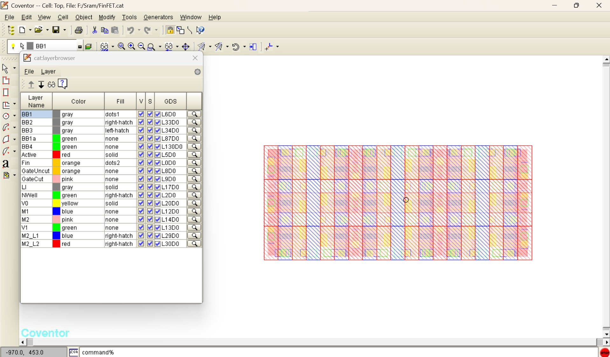

### Optimized 2-D Layout

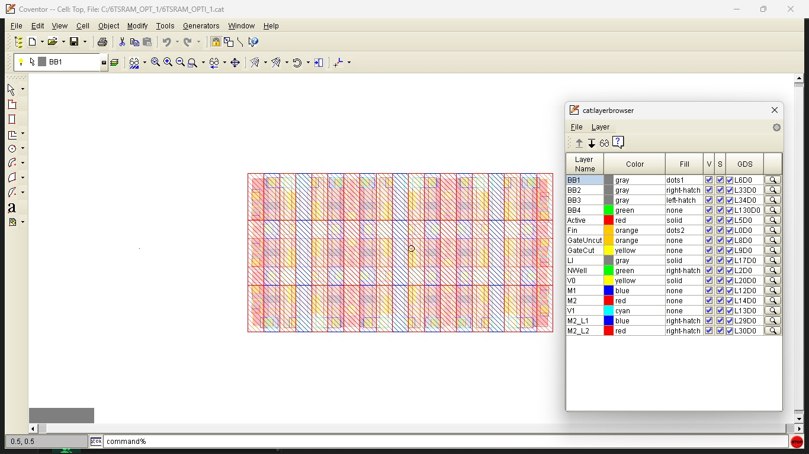

### SEMulator3D 3-D Fabricated Structure (Optimized)

| View | Image |
|---|---|
| Final 3-D structure | 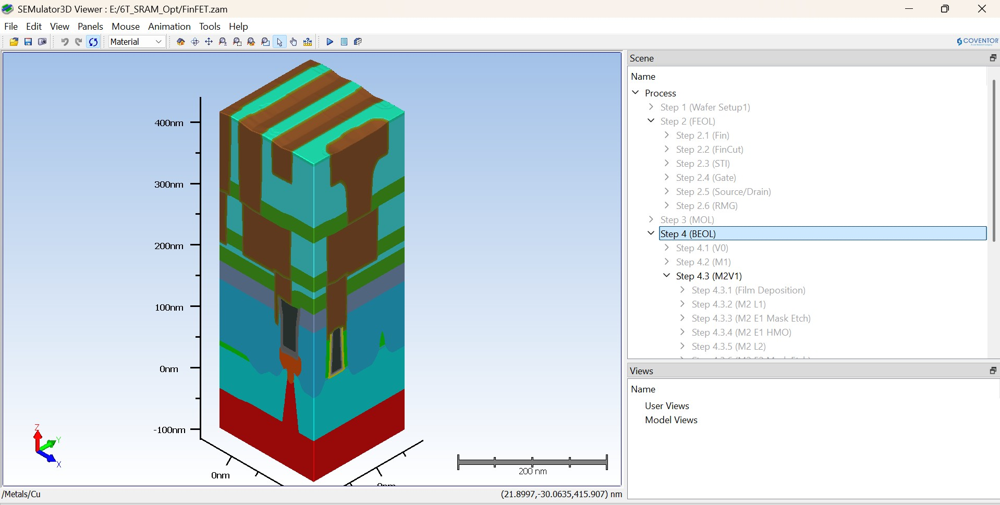 |
| Top view | 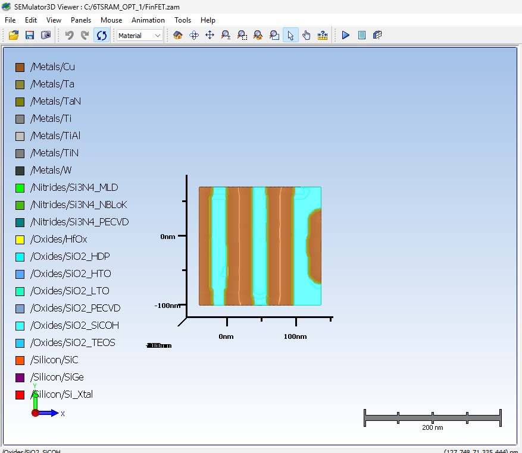 |
| Left view | 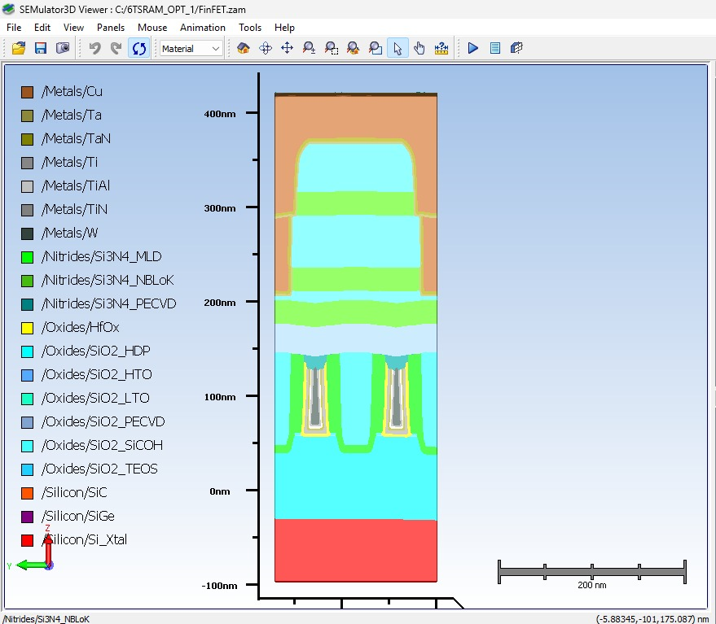 |
| Fin structure | 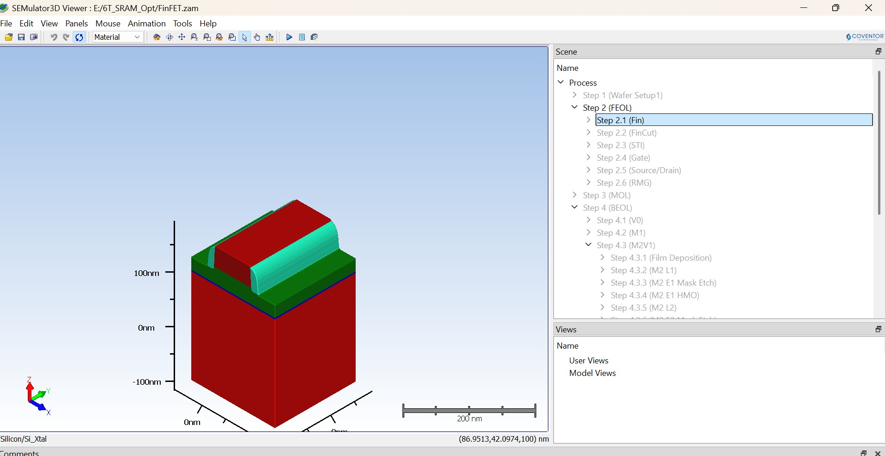 |
| Gate structure (RMG) | 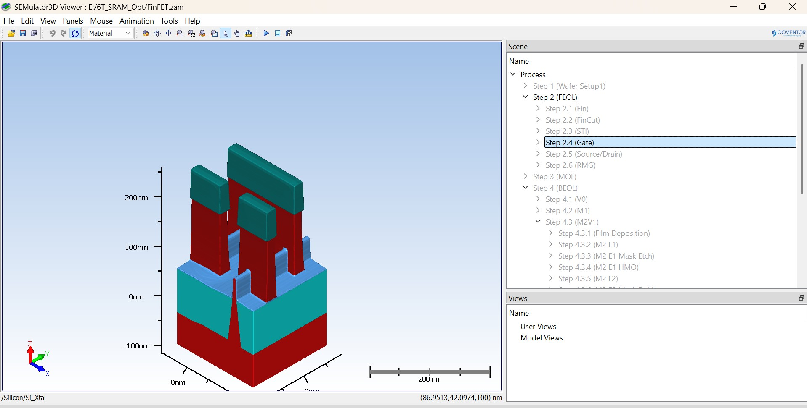 |
| MOL (Middle-of-Line) | 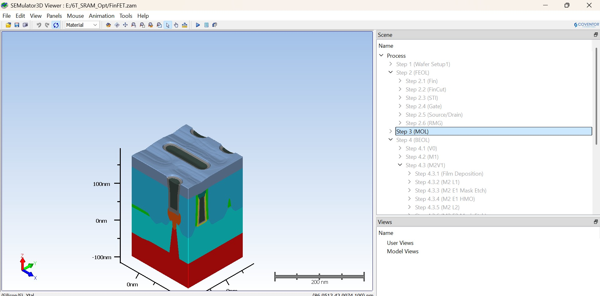 |
| V0 contacts | 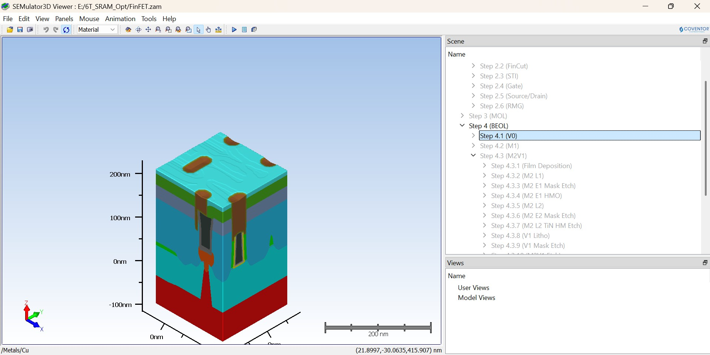 |
| Source/Drain | 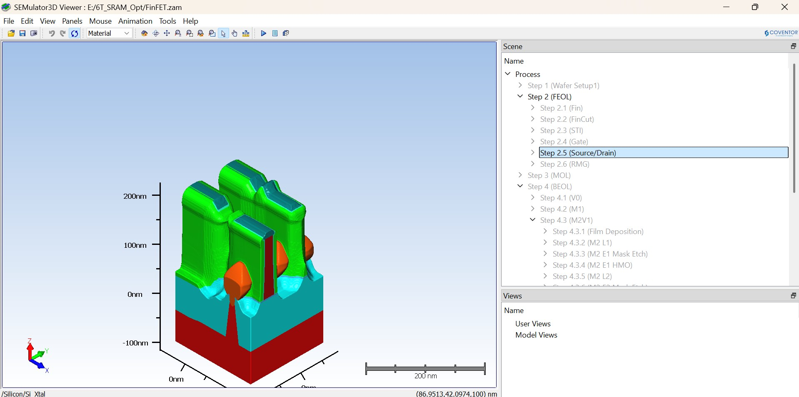 |
| STI | 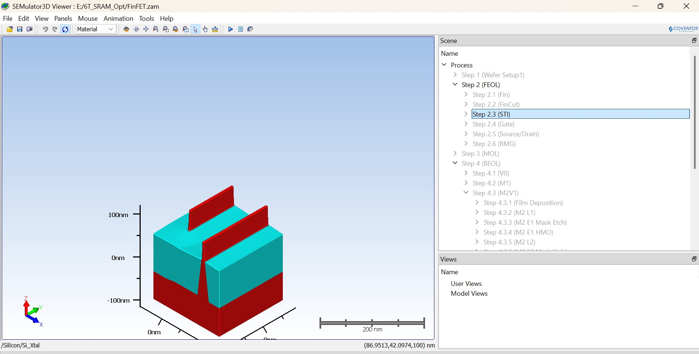 |

---

## Run Log Summary

| Run | File | Change | Result | Decision |
|---|---|---|---|---|
| R0 | Baseline | Original layout | 798,912 nm² | Reference |
| R1 | Initial opt. | Lateral compaction | Partial result | Rejected |
| R2 | Further opt. | Spacing/interconnect | Partial result | Rejected |
| R3 | Final opt. | Coordinated X-scaling (×0.82) | 655,107.84 nm² / 18% | **Selected** |
| R4 | Structural audit | FIN/GATE/ACTIVE counts | All preserved | Accepted |
| R5 | Final measurement | KLayout bounding-box | 18.00% reduction | Target achieved |
| R6 | SEMulator3D | Virtual fabrication | PASS | Accepted |

---

## Limitations

- **Optimization direction:** Only X-direction compaction was applied. Y-dimension (584 nm) is unchanged. Further reduction in Y was not attempted.
- **Manufacturability boundary:** SEMulator3D verification confirms process-integration feasibility at the virtual-fabrication level. Physical tape-out DRC/LVS against a specific foundry PDK was not performed.
- **Electrical verification:** No SPICE or electrical simulation was performed. Transistor electrical characteristics under the optimized geometry are not reported.
- **One failed intermediate run** encountered a CMP step error (void-adjacent-to-air + no target material at step 2.6.2 `RMG ILD CMP`), indicating the compacted geometry from that iteration was not process-compatible. This was resolved in the final candidate.
- **GDS measurement scope:** Measurements are 2-D bounding-box geometrical values extracted from the layout database. Fabricated film thicknesses from SEMulator3D are not included in the area calculation.

---

## Future Work

- Investigate Y-direction compaction to achieve further area reduction beyond 18%
- Explore fin count vs. lateral pitch trade-offs
- Perform poly pitch optimization
- Co-optimize contact/landing-area and routing
- Assess M1/M2 spacing and routing under foundry design rules
- Perform SPICE extraction and electrical characterization on the optimized layout
- Validate against a specific foundry PDK (DRC/LVS)

---

## Getting Started

### Prerequisites

To open and measure the GDS layouts:

- **KLayout** (open-source, cross-platform): [https://www.klayout.de/](https://www.klayout.de/)

To run SEMulator3D virtual fabrication:

- **Coventor SEMulator3D** 13.1 (commercial license required)
- SEMulator3D Python API (bundled with the tool)
- The `.vproc`, `.vmpd`, `.vanalysis`, and `.gds` input files (provided in `layout/` and `process/`)

### Opening the Baseline Layout

```bash
# Open in KLayout
klayout layout/baseline/baseline_6t_sram_finfet.gds
```

Load the layer map from `layout/baseline/layermap.txt`.

### Opening the Optimized Layout

```bash
klayout layout/optimized/optimized_6t_sram_finfet_18pct.gds
```

### Running SEMulator3D Virtual Fabrication

> **Note:** The build scripts are autogenerated by SEMulator3D and reference absolute paths from the original build machine. Update the file paths in the scripts before running in a new environment.

```bash
# Baseline
python simulation/baseline/semulator3d_baseline_build.py

# Optimized
python simulation/optimized/semulator3d_optimized_build.py
```

The scripts require the SEMulator3D Python environment (`voxelModeler`, `CModeler`, `CProcessData`, `CMaterialData` modules) provided by the Coventor installation.

---

## Project Classification

| Category | Relevance |
|---|---|
| VLSI / Physical Design | Primary |
| Semiconductor / CMOS Process | Primary |
| SRAM / Memory Design | Primary |
| FinFET Device Technology | Primary |
| Layout Optimization | Primary |
| Virtual Fabrication | Supporting |

---

## Team

| Role | Name | Institution | Year |
|---|---|---|---|
| Member 1 | Ilam Bharathi M | Chennai Institute of Technology | 2024–2028 |
| Member 2 | Aberlin Karunya J S | Chennai Institute of Technology | 2024–2028 |

**Team Name:** ChipUp

---

## References

1. S. C. Song, M. Aburahma, G. C. F. Yeap, et al., "FinFET based SRAM bitcell design for 32 nm node and below," *Microelectronics Journal*, 42(3), 520–526, 2011. DOI: 10.1016/j.mejo.2010.11.001
2. Q. Wu, Y. Li, Y. Yang, Y. Zhao, "A Photolithography Process Design for 5 nm Logic Process Flow," *Journal of Microelectronic Manufacturing*, Vol. 2, Issue 4, 2019. DOI: 10.33079/jomm.19020408

---

## License

License not specified by the project team. Contact the authors before reuse.
